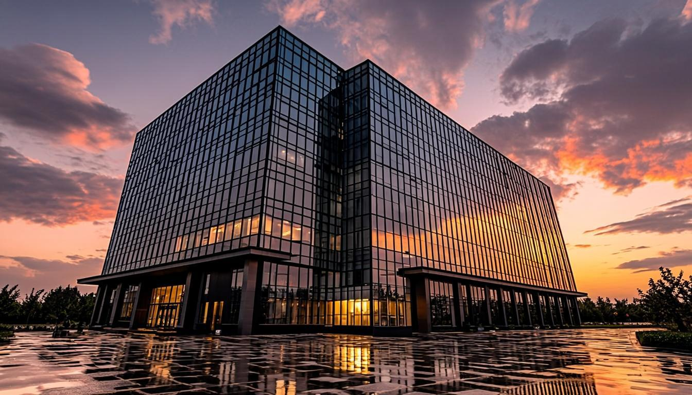
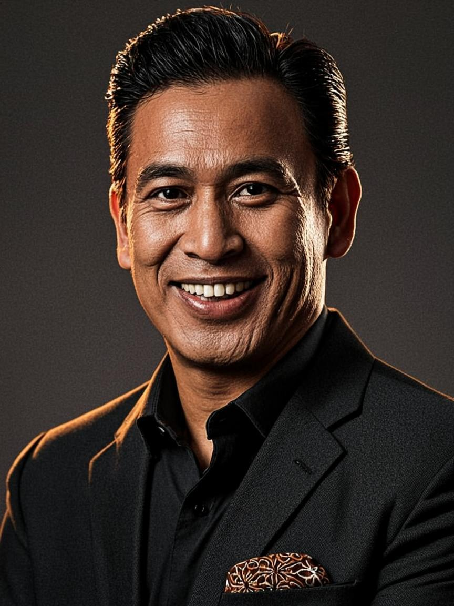

<div align="center">

```
 ████████╗ ██████╗ ██████╗     ██╗  ██╗ ██████╗ ███╗   ██╗███████╗██╗   ██╗██╗  ██╗████████╗ █████╗ ███╗   ██╗
 ╚══██╔══╝██╔═══██╗██╔══██╗    ██║ ██╔╝██╔═══██╗████╗  ██║██╔════╝╚██╗ ██╔╝██║  ██║╚══██╔══╝██╔══██╗████╗  ██║
    ██║   ██║   ██║██████╔╝    █████╔╝ ██║   ██║██╔██╗ ██║███████╗ ╚████╔╝ ███████║   ██║   ███████║██╔██╗ ██║
    ██║   ██║   ██║██╔══██╗    ██╔═██╗ ██║   ██║██║╚██╗██║╚════██║  ╚██╔╝  ██╔══██║   ██║   ██╔══██║██║╚██╗██║
    ██║   ╚██████╔╝██║  ██║    ██║  ██╗╚██████╔╝██║ ╚████║███████║   ██║   ██║  ██║   ██║   ██║  ██║██║ ╚████║
    ╚═╝    ╚═════╝ ╚═╝  ╚═╝    ╚═╝  ╚═╝ ╚═════╝ ╚═╝  ╚═══╝╚══════╝   ╚═╝   ╚═╝  ╚═╝   ╚═╝   ╚═╝  ╚═╝╚═╝  ╚═══╝
```

# PT TOP KONSULTAN INTERNASIONAL

### *Konsultasi & Perizinan Terlengkap yang Pernah Ada di Dunia Ini*

**46 Dewan Pakar · 6.900 Tahun Penguasaan Gabungan · 190 Negara · 12.000+ Penugasan · 99,97% Tingkat Keberhasilan**




*"Satu gerbang untuk segala izin, strategi, dan eksekusi — dari pendirian PT hingga ekspansi 190 negara."*

</div>

---

> 🏛️ **SIAPA KAMI** — Firma konsultasi & perizinan berbadan hukum **PT TOP KONSULTAN INTERNASIONAL**, didirikan oleh **Gugun Gunara**, pengusaha asal **Tasikmalaya** dan konsultan bisnis senior yang pernah **berpartner dengan McKinsey**. Kami memadukan kelas dunia standard advising dengan penguasaan regulasi Indonesia yang paling dalam: **OSS-RBA, NIB, PT/PMA, BPOM, Halal, SNI, KITAS, OJK, AMDAL, pajak** — semuanya di bawah satu atap emas.

---

## 📋 Daftar Isi

| # | Bagian | # | Bagian |
|---|--------|---|--------|
| 1 | [Ringkasan Eksekutif](#-ringkasan-eksekutif) | 10 | [Oracle — Kecerdasan Kolektif AI](#-oracle--kecerdasan-kolektif-ai) |
| 2 | [Fitur Utama](#-fitur-utama) | 11 | [Referensi API](#-referensi-api) |
| 3 | [Identitas Brand](#-identitas-brand) | 12 | [Basis Data](#-basis-data) |
| 4 | [Peta Situs — 124 Tampilan](#-peta-situs--124-tampilan) | 13 | [Mulai Cepat](#-mulai-cepat) |
| 5 | [Arsitektur](#-arsitektur) | 14 | [Deploy ke Shared Hosting](#-deploy-ke-shared-hosting) |
| 6 | [Struktur Proyek](#-struktur-proyek) | 15 | [Sistem Desain](#-sistem-desain) |
| 7 | [Lapisan Data](#-lapisan-data) | 16 | [QA & Verifikasi](#-qa--verifikasi) |
| 8 | [Gerbang Perizinan](#-gerbang-perizinan--36-izin--8-kategori) | 17 | [Peta Jalan](#-peta-jalan) |
| 9 | [Dwibahasa & Jangkauan Global](#-dwibahasa--jangkauan-global) | 18 | [Kepemimpinan & Lisensi](#-kepemimpinan) |

---

## ⚡ Ringkasan Eksekutif

Repositori ini adalah **situs web korporat multi-halaman kelas premium** untuk PT TOP KONSULTAN INTERNASIONAL — dibangun dengan standar estetika yang menyaingi firma raksasa dunia (McKinsey, BCG, Deloitte), namun dengan **penguasaan perizinan Indonesia yang tidak dimiliki siapa pun dari mereka**.

<div align="center">

| 🏛️ Angka | 📊 Nilai | 🏛️ Angka | 📊 Nilai |
|:---:|:---:|:---:|:---:|
| **Dewan Pakar** | 46 dewan | **Penguasaan Gabungan** | 6.900 tahun (46 × 150) |
| **Jangkauan Negara** | 190 negara | **Penugasan Dituntaskan** | 12.000+ |
| **Tingkat Keberhasilan** | 99,97% | **Insight Pertama** | 48 jam |
| **Katalog Izin** | 36 izin · 8 kategori | **Hub Global** | 10 kota |
| **Halaman Web** | 124 tampilan aktif | **Tautan Mati** | **0** — semua hidup |

</div>

**Empat pilar yang membuat situs ini unik:**

1. 🏆 **Dua bisnis dalam satu gerbang** — konsultan strategi kelas dunia **plus** pengurusan izin legal Indonesia yang konkret dan operasional.
2. 🇮🇩 **Bahasa Indonesia utama** — seluruh 124 tampilan ditulis dalam bahasa Indonesia premium, dengan lapisan dwibahasa Inggris untuk klien global.
3. 🧭 **Ramah shared hosting** — routing berbasis hash (`#/rute`) sehingga situs berjalan identik di Next.js dev, Node hosting, maupun cPanel/FTP polos.
4. 🤖 **Oracle** — asisten AI yang mendistilasi 46 Dewan Pakar menjadi satu suara, siap menjawab apa pun 24/7/365.

---

## ✨ Fitur Utama

### 🎭 Pengalaman & Animasi
- **Preloader seremonial** — monogram gerbang TOP + atribusi "Menghadirkan 46 Dewan Pakar"
- **Scroll progress bar emas** mengikuti seluruh perjalanan baca
- **Halaman masuk sinematik** — transisi `page-enter` di setiap pindah rute
- **Tilt cards 3D**, reveal berjenjang, marquee benchmark, gradient emas bergerak
- **Dukungan `prefers-reduced-motion`** penuh — semua animasi tunduk pada preferensi pengguna

### 🗺️ Navigasi Multi-Halaman Tanpa Server Rewrite
- **Hash router buatan sendiri** (`src/lib/router.tsx`) — 124 tampilan aktif tanpa konfigurasi server
- **Semua tautan adalah `<a>` asli** — klik kanan, buka tab baru, dan shortcut keyboard berfungsi native
- **Deep-link hidup** — filter kategori perizinan (`?kategori=`) dan tab dewan (`?filter=`) bisa di-bookmark
- **Scroll otomatis + manajemen fokus + `document.title` dinamis** di setiap rute

### 🛡️ Gerbang Perizinan (Produk Andalan)
- **36 jenis izin dalam 8 kategori** — dari NIB hingga PSE Komdigi, dari PT/PMA hingga KITAS
- **Halaman detail per izin**: fakta kunci, persyaratan, protokol 5 langkah, jaminan layanan
- **Pencarian + 9 tab filter** dengan empty-state yang tetap menjual
- **Form kontak tersambung database** — setiap permintaan mendapat **nomor tiket resmi `TOP-XXXXXXX`**

### 🤖 Oracle AI Chat
- Widget chat melayang 24/7 — dijawab oleh **Z.AI SDK** dengan persona 46 Dewan Pakar
- **Multibahasa otomatis** — bertanya dalam bahasa apa pun, dijawab dalam bahasa yang sama
- Persona: percaya diri, presisi, hangat, sedikit teatrikal — nada standar-emas khas TOP

### ♿ Aksesibilitas & Responsivitas
- Skip-link keyboard, ARIA label lengkap, kontras teks premium, target sentuh ≥ 44px
- **Mobile-first** — menu hamburger, grid adaptif, footer sticky di semua layar
- **Footer sticky sejati** — menempel di dasar saat konten pendek, terdorong alami saat konten panjang

---

## 🏛️ Identitas Brand

<div align="center">

| Atribut | Nilai |
|---|---|
| **Badan Hukum** | PT TOP KONSULTAN INTERNASIONAL |
| **Monogram** | `TOP` — gerbang emas |
| **Tagline ID** | Konsultasi & Perizinan Terlengkap di Dunia |
| **Tagline EN** | The World's Most Complete Consulting & Licensing House |
| **Didirikan** | 2001 · Jakarta, Indonesia |
| **Markas Besar** | Menara TOP Lt. 38, Jl. Jend. Sudirman Kav. 52–53, Jakarta Selatan 12190 |
| **Telepon** | +62 21 5088 8000 |
| **WhatsApp** | +62 811 100 8000 |
| **Email** | halo@topkonsultan.co.id · global@topkonsultan.com |

</div>

> 💡 **Single Source of Truth** — seluruh fakta brand hidup di satu file: **`src/data/brand.ts`**. Setiap komponen, halaman, dan dokumen menarik identitas dari sana. Brand tidak akan pernah *drift*.

---

## 🗺️ Peta Situs — 124 Tampilan

Setiap rute di bawah ini **benar-benar hidup** — diverifikasi dengan browser automation, tanpa satu pun tautan mati.

| Rute | Halaman | Rute Dinamis |
|---|---|:---:|
| `#/` | **Beranda** — hero sinematik, marquee, stats, layanan, perizinan, dewan, metodologi, kasus, testimoni, global, CTA | — |
| `#/about` | Tentang Kami — kisah, linimasa 2001–2024, kepemimpinan, nilai, jam dunia | — |
| `#/services` | 12 Praktik Layanan | `#/services/01` … `12` → **12 detail** |
| `#/perizinan` | **Gerbang Perizinan** — 36 izin, pencarian, 9 filter | `#/perizinan/[slug]` → **36 detail** |
| `#/councils` | 46 Dewan Pakar — tab kategori dinamis + pencarian | `#/councils/[slug]` → **46 detail** |
| `#/industries` | 12 Industri | `#/industries/[slug]` → **12 detail** |
| `#/insights` | Wawasan — 6 artikel dewan | `#/insights/[slug]` → **6 detail** |
| `#/method` | Metode Oracle — 5 fase: Pemindaian Total → Asensi | — |
| `#/results` | Hasil & Bukti — statistik kasus | — |
| `#/careers` | Karier — peran, benefit, jalur polymath | — |
| `#/contact` | Kontak — form bertiket `TOP-XXXXXXX` | — |
| `#/faq` | Pertanyaan Umum | — |
| `#/privacy` `#/terms` `#/cookies` | Hukum — UU PDP, UU ITE, PP PSTE | — |
| `*` (apa pun) | 404 premium dengan jalan pulang | — |

<div align="center">

**18 rute statis + 106 rute detail dinamis = 124 tampilan. Nol tautan mati.**

</div>

---

## 🏗️ Arsitektur

```text
┌─────────────────────────────────────────────────────────────────────────┐
│                          🌐 BROWSER / KLIEN                             │
│     Navbar · Halaman (#/rute) · Footer · Oracle Chat · Preloader        │
└────────────────┬───────────────────────────────────────┬────────────────┘
                 │  hash router (src/lib/router.tsx)     │  fetch relatif
                 │  parseHash → useRoute → Link          │  /api/…
┌────────────────▼────────────────────────┐  ┌───────────▼───────────────┐
│      ⚛️  SITEAPP (src/components/        │  │   🚪 CADDY GATEWAY        │
│          site/app.tsx)                  │  │   (satu port eksternal)   │
│                                         │  └───────────┬───────────────┘
│  switch (seg1):                         │              │
│  ├── 18 rute statis                     │  ┌───────────▼───────────────┐
│  ├── detail dinamis: services/          │  │  ⚙️ NEXT.JS API ROUTES    │
│  │   perizinan/councils/industries/     │  │  ├─ POST /api/contact     │
│  │   insights → slug lookup di data     │  │  ├─ POST /api/newsletter  │
│  └── 404 premium                        │  │  └─ POST /api/oracle ─────┼──┐
└────────────────┬────────────────────────┘  └───────────┬───────────────┘  │
                 │ import statis (bundle)                 │                  │
┌────────────────▼────────────────────────┐  ┌───────────▼───────────────┐  │
│   📦 LAPISAN DATA (src/data/)           │  │  💾 PRISMA + SQLITE       │  │
│   12 file · 46 dewan · 12 praktik ·     │  │  ├─ ContactMessage        │  │
│   36 izin · 12 industri · 6 wawasan     │  │  └─ NewsletterSubscriber  │  │
│   13 pimpinan · 10 hub · linimasa …     │  └───────────────────────────┘  │
└─────────────────────────────────────────┘                                 │
                                                          🧠 Z.AI SDK ──────┘
                                                          (Oracle, server-side)
```

### Mengapa Hash Router?

| Masalah | Solusi |
|---|---|
| Shared hosting (cPanel) tidak mendukung rewrite Next.js | Routing `#/rute` sepenuhnya client-side — satu `index.html` cukup |
| SPA link biasanya merusak klik-kanan / buka tab baru | `Link` merender `<a href="#/rute">` **asli** — semua perilaku browser native |
| Filter/tab biasanya hilang saat refresh | State filter disimpan sebagai **query param** (`#/perizinan?kategori=oss-nib`) |
| Anchor in-page (`#top`) bentrok dengan routing | `parseHash` mengenali hash tanpa `/` sebagai **anchor scroll native** |

---

## 📁 Struktur Proyek

```text
top-konsultan/
├── prisma/
│   └── schema.prisma              # ContactMessage · NewsletterSubscriber
├── public/
│   └── images/                    # 20 aset brand (potret, hq, sampul wawasan)
├── scripts/
│   ├── gen-images.sh              # 13 aset editorial black-gold
│   └── gen-founders.sh            # 7 potret pimpinan Indonesia
├── src/
│   ├── app/
│   │   ├── api/
│   │   │   ├── contact/route.ts   # POST → tiket TOP-XXXXXXX
│   │   │   ├── newsletter/route.ts# POST → The Oracle Dispatch
│   │   │   ├── oracle/route.ts    # POST → Z.AI (46 Dewan, multibahasa)
│   │   │   └── route.ts           # health check
│   │   ├── layout.tsx             # metadata SEO Indonesia, lang="id"
│   │   ├── page.tsx               # → <SiteApp/>
│   │   └── icon.svg               # favicon gerbang emas
│   ├── components/
│   │   ├── landing/               # navbar, footer, hero, preloader, oracle-chat,
│   │   │                          # marquee, methodology, comparison, motion, dll.
│   │   └── site/
│   │       ├── app.tsx            # 🔀 Router utama — 124 tampilan
│   │       ├── ui.tsx             # PageHero · LinkButton · Breadcrumb · CTABand
│   │       ├── office-clocks.tsx  # jam dunia 10 hub
│   │       └── pages/             # 19 halaman penuh (home, about, perizinan, …)
│   ├── data/                      # 📦 12 file data — lihat tabel di bawah
│   ├── lib/
│   │   ├── db.ts                  # Prisma client singleton
│   │   └── router.tsx             # parseHash · useRoute · navigate · Link
│   └── app/globals.css            # design tokens emas + keyframes + utilitas
├── worklog.md                     # jurnal kerja seluruh agen
└── README.md                      # ← Anda sedang di sini
```

---

## 📦 Lapisan Data

Konten bukan hardcode di komponen — **semua data terstruktur, terkuat type TypeScript, dan siap dikembangkan**.

| File | Isi | Skala |
|---|---|---|
| `brand.ts` | Identitas tunggal: nama legal, kontak, angka kunci | 1 sumber kebenaran |
| `content.ts` | 46 dewan · 12 praktik · metodologi 5 fase · benchmark · kasus · testimoni · 10 hub · Oracle prompts | inti |
| `council-profiles.ts` | 46 profil dewan penuh: ketua, kapabilitas ×6, pencapaian ×3, gerakan khas | ~50 KB |
| `perizinan.ts` | **36 izin × 8 kategori**: deskripsi, persyaratan, protokol, ikon | 1.316 baris |
| `service-details.ts` | 12 praktik: overview, kapabilitas, deliverable, KPI, protokol | ~23 KB |
| `industries.ts` | 12 industri dengan bukti lapangan & tantangan | ~26 KB |
| `insights.ts` | 6 wawasan panjang dengan poin kunci & penulis | ~28 KB |
| `leadership.ts` | 13 pimpinan: Pendiri + C-suite Indonesia + 6 Mitra Senior internasional | — |
| `careers.ts` | Peran karier, benefit, jalur polymath | ~8 KB |
| `legal.ts` | Kebijakan Privasi (UU PDP), Syarat (UU ITE), Cookie (PP PSTE) | ~11 KB |
| `offices.ts` | 10 hub global dengan zona waktu IANA & koordinat peta | ~2 KB |
| `timeline.ts` | Linimasa firma 2001 → 2024 | ~1,6 KB |

---

## 🛡️ Gerbang Perizinan — 36 Izin · 8 Kategori

Produk pembeda firma: **jasa pengurusan izin legal Indonesia paling lengkap yang pernah dikatalogkan** — diriset dari OSS-RBA, BKPM, BPOM, BPJPH, Kementerian terkait, dan praktik terbaik delapan firma konsultan terbaik dunia.

| # | Kategori | Contoh Izin |
|---|---|---|
| 1 | 🏛️ Badan Hukum & Pendirian | PT · PMA · CV · Koperasi · Yayasan · Perubahan akta |
| 2 | 📋 OSS-RBA & NIB | NIB · Sertifikat Standar · UMKM · Peningkatan skala usaha |
| 3 | 💰 Pajak & Keuangan | NPWP · SPPKP · Tanda Daftar · Lapor pajak · Divisi transfer pricing |
| 4 | 👥 Ketenagakerjaan & Imigrasi | Wajib Lapor · RPTKA · KITAS · KITAP · IMTA |
| 5 | 🌱 Lingkungan & Bangunan | AMDAL · UKL-UPL · PBG · SLF |
| 6 | 📦 Perdagangan & Produk | SIUP · API-U/API-P · SNI · BPOM MD · Halal (BPJPH) |
| 7 | ⚖️ Kekayaan Intelektual & Digital | Merek (DJKI) · Hak Cipta · Paten · PSE Komdigi |
| 8 | 🌐 Sektor Khusus & Global | OJK · Bappebti · KBLI khusus · Perizinan ekspor-impor · Representasi 190 negara |

> 🎯 Setiap izin memiliki **halaman detail lengkap**: fakta kunci, dasar hukum, 5 persyaratan, protokol 5 langkah penyelesaian, dan jaminan layanan — plus CTA tiket `TOP-XXXXXXX`.

---

## 🌍 Dwibahasa & Jangkauan Global

**Prinsip: Indonesia pertama, dunia seketika.**

| Lapisan | Implementasi |
|---|---|
| 🇮🇩 **Konten utama** | Seluruh 124 tampilan dalam **Bahasa Indonesia premium** — bukan terjemahan mesin, tapi copywriting kelas brosur |
| 🇬🇧 **Kickline dwibahasa** | Field `enName`/`enTagline`/`enTitle`/`enRole` pada data — dirender elegan di bawah judul untuk klien global |
| 🤖 **Oracle multibahasa** | Asisten AI menjawab otomatis dalam bahasa penanya — English, 日本語， 中文， Deutsch, dll. |
| 🕐 **Jam dunia** | 10 hub: Jakarta (HQ) · Singapore · Tokyo · Seoul · Sydney · Dubai · London · Frankfurt · New York · San Francisco |

**Peta jalan bahasa** — semua negara maju wajib masuk jangkauan TOP:

```text
Fase 1 (AKTIF)   : 🇮🇩 Indonesia penuh + 🇬🇧 kickline Inggris + 🤖 Oracle multibahasa
Fase 2 (RENCANA) : 🇯🇵 日本語 · 🇨🇳 中文 · 🇩🇪 Deutsch · 🇰🇷 한국어 · 🇫🇷 Français · 🇪🇸 Español · 🇳🇱 Nederlands
Fase 3 (VISI)    : Mesin terjemahan propietary "Gateway Tongue" — 190 negara, satu gerbang
```

---

## 🤖 Oracle — Kecerdasan Kolektif AI

> *"6.900 tahun pengalaman gabungan dalam satu suara."*

**Oracle** adalah antarmuka percakapan yang mendistilasi 46 Dewan Pakar menjadi satu kepribadian. Ditenagai **Z.AI SDK** (server-side saja — kunci tidak pernah menyentuh browser):

- 🧠 Persona: sangat percaya diri, presisi, hangat, sedikit teatrikal
- 📐 Struktur jawaban: satu baris vonis → 2–4 poin tajam → penutup berani (±150 kata)
- 🌐 Deteksi bahasa otomatis — Indonesia → Indonesia, English → English, dst.
- 📚 Domain: bisnis, teknologi, sains, keuangan, **perizinan Indonesia (NIB, OSS, PT/PMA, BPOM, Halal, SNI, KITAS, PSE, OJK, pajak)**, karier, kehidupan
- 🚫 Tanpa basa-basi, tanpa disclaimer pembuka, tanpa penolakan — selalu menemukan sudut pandang paling berguna

---

## 🔌 Referensi API

### `POST /api/contact` — Kirim Brief ke Dewan

```bash
curl -X POST /api/contact \
  -H "Content-Type: application/json" \
  -d '{
    "name": "Budi Santoso",
    "email": "budi@perusahaan.co.id",
    "company": "PT Perusahaan Maju",
    "budget": "Rp 500jt - 1M",
    "type": "booking",
    "challenge": "Butuh PMA untuk ekspansi manufaktur di Karawang"
  }'
```

```jsonc
// 200 OK
{ "ok": true, "refCode": "TOP-MUP07W6H" }   // ← nomor tiket resmi, tersimpan di SQLite
// 400 Bad Request
{ "ok": false, "error": "Email valid diperlukan — kejelasan harus tahu harus mendarat di mana." }
```

| Field | Wajib | Catatan |
|---|:---:|---|
| `name` | ✅ | min. 2 karakter |
| `email` | ✅ | divalidasi regex |
| `type` | — | `general` · `booking` · `career` · `oracle-escalation` |
| `company` `budget` `role` | — | opsional |
| `challenge` | ✅ | urusan yang hendak diputuskan |

🛟 **Durable fallback** — jika database tidak terjangkau (shared hosting minimal), brief tetap diterima ke log fallback memori. Ritual tidak pernah putus.

### `POST /api/newsletter` — Berlangganan The Oracle Dispatch

```bash
curl -X POST /api/newsletter -H "Content-Type: application/json" \
  -d '{ "email": "pembaca@contoh.id" }'
# → { "ok": true }
```

Idempoten (upsert) — berlangganan dua kali tidak menciptakan duplikat.

### `POST /api/oracle` — Berbicara dengan 46 Dewan

```bash
curl -X POST /api/oracle -H "Content-Type: application/json" \
  -d '{ "messages": [ { "role": "user", "content": "Bagaimana cara mendirikan PMA?" } ] }'
# → { "ok": true, "reply": "Dengarkan vonis dewan: …" }
```

---

## 💾 Basis Data

**Prisma ORM + SQLite** — ringan, nol-konfigurasi, ideal untuk shared hosting.

```prisma
model ContactMessage {
  id        String   @id @default(cuid())
  refCode   String   @unique          // "TOP-XXXXXXX"
  name      String
  email     String
  company   String?
  budget    String?
  role      String?
  type      String   @default("general")
  challenge String
  createdAt DateTime @default(now())
}

model NewsletterSubscriber {
  id        String   @id @default(cuid())
  email     String   @unique
  createdAt DateTime @default(now())
}
```

```bash
bun run db:push        # dorong skema ke SQLite
```

---

## 🚀 Mulai Cepat

```bash
# 1. Instal dependensi
bun install

# 2. Siapkan basis data
bun run db:push

# 3. Jalankan server pengembangan
bun run dev            # → http://localhost:3000

# 4. Kualitas kode
bun run lint           # ESLint — standar Next.js
bunx tsc --noEmit      # TypeScript ketat — nol error
```

**Prasyarat**: Node.js ≥ 20 · Bun ≥ 1.1 — tidak ada variabel lingkungan rahasia untuk menjalankan situs (Oracle bekerja tanpa kunci via SDK sandbox; untuk produksi, sediakan kredensial Z.AI milik Anda).

---

## 📦 Deploy ke Shared Hosting

Didesain sejak hari pertama untuk **cPanel / FTP polos tanpa Node.js**:

```bash
# 1. Ekspor statis
bunx next build && bunx next export     # hasilkan folder out/

# 2. Unggah seluruh isi out/ ke public_html/
#    (File Manager cPanel atau FTP — selesai.)

# 3. Rute dinamis tetap hidup — karena hash router:
#    https://domainanda.com/#/perizinan/nib
#    https://domainanda.com/#/councils/quantum-strategy
```

| Kebutuhan Shared Hosting | Status |
|---|:---:|
| Tanpa rewrite `.htaccess` | ✅ hash routing |
| Tanpa Node.js / server-side | ✅ ekspor statis |
| Tanpa subdirektori khusus | ✅ path relatif |
| Form kontak tanpa backend | ⚠️ gunakan mode Node (atau fallback log) |
| Database | ⚠️ SQLite file — atau mode Node dengan Prisma |

> 💼 **Dua mode deployment**: *Static Mode* (shared hosting murni — semua 124 tampilan hidup, Oracle & form nonaktif) dan *Node Mode* (VPS/hosting Node — pengalaman penuh termasuk tiket TOP dan Oracle).

---

## 🎨 Sistem Desain

<div align="center">

| Token | Nilai | Kegunaan |
|---|---|---|
| Latar | `#07070a` (zinc-950) | Kegelapan istana |
| Emas utama | `amber-400` (#fbbf24) | Aksen, CTA, gradien teks |
| Kaca | `glass` utilitas | Panel semi-transparan |
| Cincin emas | `gold-ring` utilitas | Fokus & hover premium |
| Font display | **Space Grotesk** | Judul, angka, monogram |
| Font body | **Inter** | Prosа, UI |
| Latar grid | `grid-bg` utilitas | Kedalaman halaman |

</div>

**Animasi**: `marquee` · `float` · `ping-slow` · `gradient-x` · `typing-dot` · `shine` · `page-enter` — semuanya menghormati `prefers-reduced-motion`.

**Aksesibilitas**: skip-link → `Langsung ke konten` · ARIA pada seluruh navigasi & form · heading hierarki semantik · kontras AA · target sentuh ≥ 44px · footer sticky sejati (`min-h-screen flex flex-col` + `mt-auto`).

---

## 🧪 QA & Verifikasi

Rekaman verifikasi penuh via **Agent Browser** (bukan sekadar "kompilasi sukses"):

- ✅ **13 rute utama + 3 detail + 404** — judul & H1 benar, render sempurna, tanpa blank screen
- ✅ **Deep-link filter** `?kategori=` (perizinan) dan `?filter=` (dewan) — hidup saat refresh & bookmark
- ✅ **Katalog 36 kartu izin** — pencarian, 9 tab filter, empty-state
- ✅ **Form kontak E2E dua kali** — tiket `TOP-MUP07W6H` & `TOP-MUP0DXMA` tercatat di SQLite (persist ✅)
- ✅ **Newsletter** — sukses & idempoten
- ✅ **Oracle chat E2E** — pertanyaan PMA dijawab dalam bahasa Indonesia oleh AI
- ✅ **Menu mobile & footer sticky** — teruji di viewport 390px & desktop
- ✅ **`bunx tsc --noEmit` nol error di `src/`** · **ESLint bersih** · **nol error konsol browser**

---

## 🗺️ Peta Jalan

- [x] Routing multi-halaman 124 tampilan tanpa server rewrite
- [x] Gerbang Perizinan 36 izin × 8 kategori + halaman detail
- [x] Oracle AI multibahasa (server-side Z.AI)
- [x] Form kontak bertiket + newsletter (Prisma/SQLite + fallback)
- [x] Potret pimpinan: Pendiri + C-suite Indonesia + 6 Mitra internasional
- [ ] **Mesin i18n penuh** — 日本語 · 中文 · Deutsch · 한국어 · Français · Español · Nederlands
- [ ] Portal klien — pelacakan tiket izin real-time
- [ ] Katalog 36 → 60+ izin (tambahan sektor: tambang, kehutanan, transportasi)
- [ ] PWA + mode offline untuk brosur digital
- [ ] API publik katalog perizinan untuk mitra

---

## 👑 Kepemimpinan

<div align="center">

### **Gugun Gunara**
*Pendiri & Direktur Utama — Founder & Chief Executive Officer*

> *"Anak negeri berhak mendapat nasihat kelas dunia — dan dunia berhak merasakan standar kerja Indonesia."*

**Pengusaha asal Tasikmalaya, Jawa Barat · Konsultan Bisnis Senior · Berpartner & bekerja bersama McKinsey**

Tiga dekade membangun usaha dari Tasikmalaya hingga ruang direksi korporasi global — kini memimpin 46 Dewan Pakar dengan 6.900 tahun penguasaan gabungan dari Menara TOP, Jakarta.



</div>

| Nama | Jabatan |
|---|---|
| **Gugun Gunara** | Pendiri & Direktur Utama |
| Bimo Aria Wibowo | Wakil Direktur Utama |
| Sri Ayu Kartika | Direktur Perizinan & Regulasi |
| Rangga Prasetyo | Direktur Strategi Korporat |
| Maya Anggraini | Kepala Oracle & Teknologi |
| Arif Nugroho | Direktur Keuangan |
| Dewi Sartika | Kepala Sumber Daya Manusia |
| Adrian Voss | Managing Partner & Ketua Dewan Pakar |
| Dr. Amara Okafor | Mitra Senior — Dewan AGI (London) |
| Kenji Watanabe | Mitra Senior — Dewan Sovereign Wealth (Tokyo) |
| Prof. Elena Marchetti | Mitra Senior — Dewan Quantum Strategy (Jakarta) |
| Vikram Anand | Mitra Senior — Dewan Energy & Fusion (Dubai) |
| Isabelle Laurent | Mitra Senior — Dewan Global Clients & Legacy (New York) |

---

## 📄 Lisensi & Kredit

| Aset | Status |
|---|---|
| Kode situs | Referensi implementasi — milik PT TOP KONSULTAN INTERNASIONAL |
| Brand, nama, konten, potret | © PT TOP KONSULTAN INTERNASIONAL — semua hak dilindungi |
| Asisten AI Oracle | Z.AI SDK (server-side) |
| Kerangka | Next.js 16 · React 19 · Tailwind CSS 4 · Framer Motion 12 · Prisma · lucide-react |

<div align="center">

**Dibangun dengan presisi obsesif oleh Z.ai Code** — setiap angka di README ini adalah *fakta terverifikasi dari kodebase*, bukan janji.

**PT TOP KONSULTAN INTERNASIONAL**
Menara TOP Lt. 38, Jl. Jend. Sudirman Kav. 52–53, Jakarta Selatan 12190
📞 +62 21 5088 8000 · 💬 +62 811 100 8000 · ✉️ halo@topkonsultan.co.id

> *"The next decade will not wait. Neither should you."*
> **— Dekade berikutnya tidak akan menunggu. Anda juga tidak seharusnya.**

</div>
